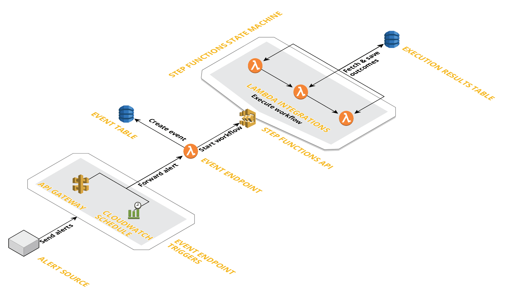

# SOCless

SOCless is a serverless framework built to help security teams easily automate their incident response and operations processes.

## Overview
SOCless uses the [AWS Step Functions](https://aws.amazon.com/step-functions/) and [AWS Lambda](https://aws.amazon.com/lambda/) services to execute user-defined workflows. The workflows, called Playbooks, are defined as JSON objects and triggered by real-time alerts from http-based data sources or scheduled events from [AWS CloudWatch](https://aws.amazon.com/cloudwatch).

(Click to enlarge)

## Features
- Respond to real-time or scheduled events
- Orchestrate existing security tools into workflows using AWS Lambda functions written in Python 3
- Interact with humans as part of automated workflows and adapt to their responses
- Connect to internal resources via static IP whitelisting
- Develop use-cases rapidly courtesy of reusable, modular and shareable plugins
- Store and deploy infrastructure and response plans as code using [The Serverless Framework](https://serverless.com)
- Enjoy low cost, low operational overhead, and effortless scalability courtesy of serverless design
- Extend architecture to implement unique use-cases using AWS services

To get started, [deploy SOCless!](deploying-socless)
